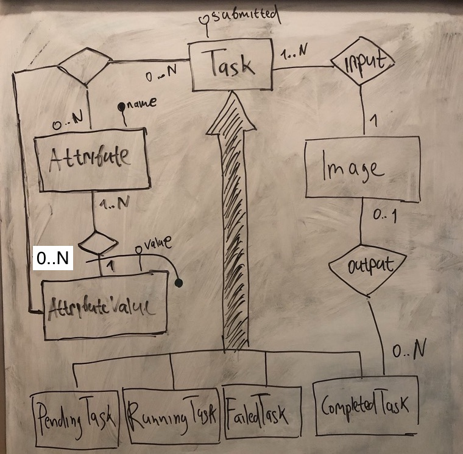

# Анализ

## ER модель



### Сущности

* Attribute - характеристика, которая может использоваться как критерий при распознавании
    * name: string not null - название характеристики
* AttributeValue - значение характеристики
    * value: string not null - возможное значение соответствующей характеристики
* Image - изображение
* Task - задача распознавания
    * submitted: timestamp not null - время, когда задача была создана
* PendingTask - задача распознавания, которая ещё не была обработана
* RunningTask - задача распознавания, которая находится в процессе обработки
* FailedTask - задача распознавания, при обработке которой возникла ошибка
    * errorDescription string not null - описание ошибки
* CompletedTask - задача распознавания, которая была успешно обработана

### Дополнительные ограничения

1. Значение характеристики, ассоциированное с задачей распознавания, должно принадлежать множеству значений характеристики, ассоциированной с заданием.
```
forall t, a, v . taskAttributeValue(t, a, v) -> attributeValue(a, v)
```
2. Характеристика не может быть связана с более чем одним значением для одной и той же задачи.
```
forall t, a, v, v' . taskAttributeValue(t, a, v) and taskAttributeValue(t, a, v') -> v = v'
```
3. Изображение, являющееся результатом задачи распознавания, должно быть одним из изображений подданных ей на вход. 
```
forall t, im . output(t, im) -> input(t, im)
```

## ML модель

*Описать выбранную/разработанную модель, её преимущества и недостатки.
Мотивировать выбор.
На этом уровне описываем именно модель, а не конкретную технологию реализущую её.*
