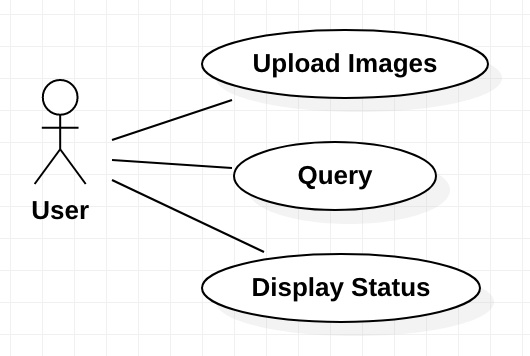

# Use Case модель

## Upload Images

Загрузка изображений.

### Актор

Пользователь.

### Аргументы

Набор изображений.

### Предусловия

Отсутствуют.

### Порядок событий

1. Пользователь выбирает загрузку изображений.
2. Система запрашивает пользователя загрузить изображения по одному или zip-архивом.

### Постусловия

1. Изображения сохранены в системе.
2. Изображения распознаны: для каждого из них для каждой характеристики (см. требования п. 2) выбрано значение.

## Query

Запрос изображений соответствующих заданным критериям.

### Актор

Пользователь.

### Аргументы

Набор пар характеристика-значение (сп требования п. 2).
Каждая характеристика может присутствовать в этом наборе только один раз.

### Предусловия

Отсутствуют.

### Порядок событий

1. Пользователь выбирает отбор изображений.
2. Система запрашивает пользователя указать искомые значения для характеристик (см. требования п. 2).
3. Пользователь вводит данные.
4. Система предоставляет пользователю набор изображений, соответствующих заданным критериям отбора.

### Постусловия

Набор изображений, соответствующих заданным критериям отбора отображён на экране.

## Display Status

Отображение статистики по загруженным изображениям.

### Актор

Пользователь.

### Аргументы

Отсутствуют.

### Предусловия

Отсутствуют.

### Порядок событий

1. Пользователь выбирает отображение текущего состояния системы.
2. Система отображает текущее состояние системы (см. требования п. 3). 

### Постусловия

Текущее состояние системы отображенo на экране.
