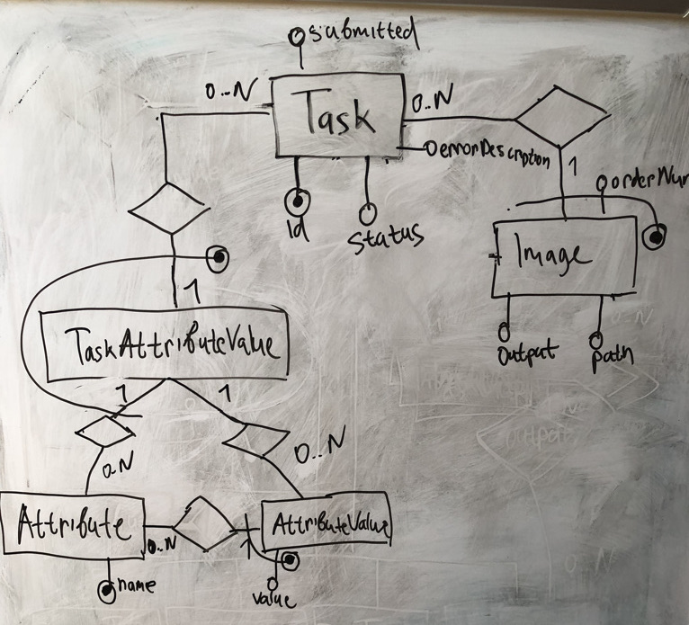

# Дизайн

## ER модель



### Сущности

* Attribute - характеристика, которая может использоваться как критерий при распознавании
    * name: string not null - название характеристики
* AttributeValue - значение характеристики
    * value: string not null - возможное значение соответствующей характеристики
* Image - изображение
    * orderNum: integer not null - порядковый номер изображение в задаче распознавания
    * path string not null - путь к изображению в файловой системе
    * output: boolean - флаг, который помечает изображение как результат задачи распознавания
* Task - задача распознавания
    * id: integer not null - идентификатор задачи распознавания
    * submitted: timestamp not null - время, когда задача была создана
    * status: enum (PENDING, RUNNING, FAILED, COMPLETED) not null - статус задачи распознавания
    * errorDescription string - описание ошибки для задачи распознавания, обработка которой завершилась с ошибкой
* TaskAttributeValue

### Дополнительные ограничения

1. Значение характеристики, ассоциированное с задачей распознавания, должно принадлежать множеству значений характеристики, ассоциированной с заданием.

```
forall t, a, v . TaskAttributeValue(t, a, v) -> attributeValue(a, v)
```

2. Множество возможны значений характеристики не может быть пустым.

```
forall a . Attribute(a) -> (exists v . AttributeValue(a, v))
```

3. Задача распознавания должна иметь хотя бы одно входное изображение.

```
forall t . Task(t) -> (exists im . taskImage(t, im))
```

4. Задача распознавания, обработка которая завершилась с ошибкой должна иметь описание этой ошибки.

```
forall t . Task(t) and status(t, FAILED) -> (exists d . errorDescription(t, d) and d <> null)
```

5. Входные изображения задачи распознавания, обработка которая успешно завершилась, должны быть помечены как принадлежащие или нет результату распознавания.

```
forall t . Task(t) and status(t, COMPLETED) -> (exists o . output(t, o) and o <> null)
```

## Функционал

Система реализована как двухуровневое Web-приложение:
* RESTful сервер;
* клиентская часть в виде Web-страницы.

### RESTful API

* Получить список характеристик и их возможные значения.
    * Request
        * URL: `/attributes`
        * Method: `GET`
    * Response
        * Success
            * Code: 200
            * Body:
            ```
            [
              {
                "name": string,
                "values": [
                  string,
                  ...
                ]
              },
              ...
            ]
            ```
        * Failure
            * Code: 500
            * Body:
            ```
            {
              "message": string
            }
            ```
* Получить список задач распознавания
    * Request
        * URL: `/tasks`
        * Method: `GET`
    * Response
        * Success
            * Code: 200
            * Body:
            ```
            [
              {
                "id": number,
                "submitted": number,
                "status": "pending" | "running" | "failed" | "completed"
              },
              ...
            ]
            ```
        * Failure
            * Code: 500
            * Body:
            ```
            {
              "message": string
            }
            ```
* Создать задачу распознавания
    * Request
        * URL: `/tasks`
        * Method: `POST`
        * Body
        ```
        {
          "images": [
            string,
            ...

          ],
          "attributes": [
            {
              "name": string,
              "value": string
            },
            ...
          ]
        }
        ```
    * Response
        * Success
            * Code: 201
            * Body:
            ```
            {
              "id": number,
              "submitted": number
            }
            ```
        * Failure
            * Code: 500
            * Body:
            ```
            {
              "message": string
            }
            ```
* Получить задачу распознавания
    * Request
        * URL: `/tasks/<id>`
        * Method: `GET`
    * Response
        * Success
            * Code: 200
            * Body:
            ```
            {
              "id": number,
              "submitted": number,
              "status": "pending" | "running" | "failed" | "completed",
              "images": [
                string,
                ...
              ],
              "attributes": [
                {
                  "name": string,
                  "value": string
                },
                ...
              ],
              "output": [
                number,
                ...
              ] | null,
              "error": string | null
            }
            ```
        * Failure
            * Code: 500
            * Body:
            ```
            {
              "message": string
            }
            ```
