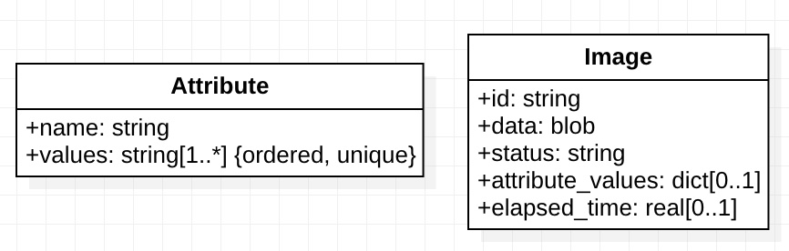
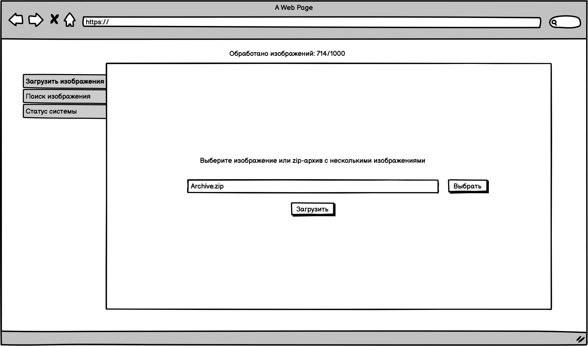
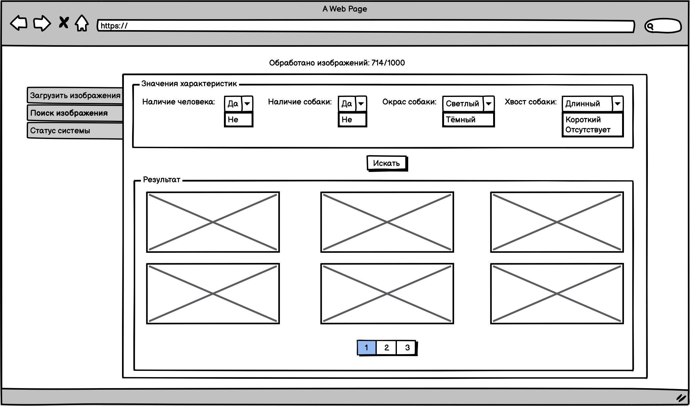
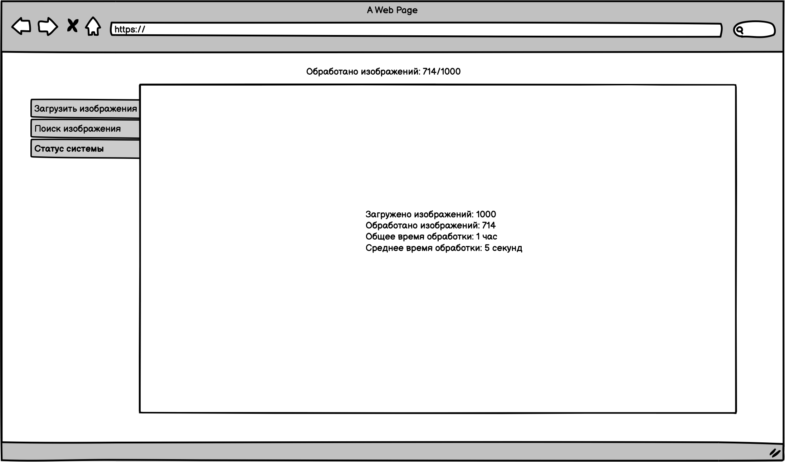
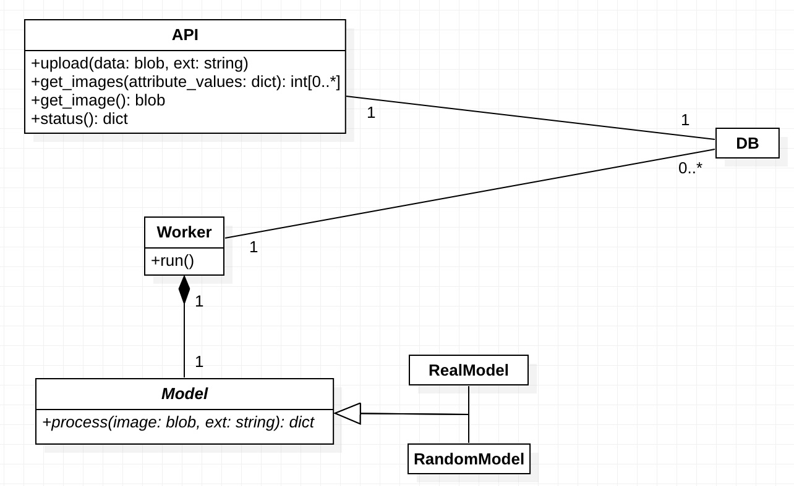

# Дизайн

Система реализована как двухуровневое Web-приложение:

* пользовательский интерфейс в виде Web-страницы;
* сервер, предоставляющий RESTful API для загрузки изображений и запросов к ним.

Так как обработка изображения моделью распознавания может требовать значительных вычислительных ресурсов, она выполняется асинхронно: пользователь загружает изображения, а система обрабатывает их по мере доступности вычислительных ресурсов.

## Модель данных

В процессе анализа была выявлена относительная простота модели данных и отсутствие необходимости выполнять сложные запросы к ней.
Соответственно было принято решение использовать для хранения данных системы документоорентированную БД.



### Дополнительные ограничения

1. Каждое изображение может находиться в одном из трёх состояний: pending, processing, processed.
```
forall
  i, s
(
  Image(i) ∧ status(i, s)
)
->
(
  s = "PENDING"
  ∨
  s = "PROCESSING"
  ∨
  s = "PROCESSED"
)
```
2. Каждое обработанное изображение должно иметь значение для каждой характеристики.
```
forall
  i, a, s
(
  Image(i) ∧ Attribute(a) ∧ status(i, "PROCESSED") ∧ name(a, s)
)
->
(
  exists
    av
  (
    attribute_values(i, av) ∧ av[s] != null
  )
)
```

## RESTful API

* Получить список характеристик и их возможные значения.
    * Request
        * URL: `/attributes`
        * Method: `GET`
    * Response
        * Success
            * Code: 200
            * Content-Type: `application/json`
            * Body:
            ```
            [
              {
                "name": string,
                "values": [
                  string,
                  ...
                ]
              },
              ...
            ]
            ```
        * Failure
            * Code: 500
            * Content-Type: `application/json`
            * Body:
            ```
            {
              "message": string
            }
            ```
* Загрузить изображение.
    * Request
        * URL: `/images`
        * Method: `POST`
        * Content-Type: `application/bson`
        * Body:
        ```
        {
          "data": blob,
          "ext": string
        }
        ```
        If `ext` is `zip` then `data` is treated as zip archive of images, otherwise as as single image with file extension `ext`.
    * Response
        * Success
            * Code: 201
        * Failure
            * Internal Server Error
                * Code: 500
                * Body:
                ```
                {
                  "message": string
                }
                ```
* Запросить изображения, соответствующие заданным критериям.
    * Request
        * URL: `/images`
        * Method: `GET`
        * Query:
            * `attribute1=value1`
            * ...
    * Response
        * Success
            * Code: 200
            * Content-Type: `application/json`
            * Body:
            ```
            [
              {
                "id": number,
                "attribute_values": {
                  "attribute1": "value1",
                  ...
                }
              },
              ...
            ]
            ```
        * Failure
            * Bad Request
                * Code: 400
                * Content-Type: `application/json`
                * Body:
                ```
                {
                  "message": string
                }
                ```
            * Internal Server Error
                * Code: 500
                * Content-Type: `application/json`
                * Body:
                ```
                {
                  "message": string
                }
                ```
* Запросить изображение по его идентификатору.
    * Request
        * URL: `/images/<id>`
        * Method: `GET`
    * Response
        * Success
            * Code: 200
            * Content-Type: `application/bson`
            * Body:
            ```
            [
              {
                "id": number,
                "data": blob
              },
              ...
            ]
            ```
        * Failure
            * Not Found
                * Code: 404
                * Content-Type: `application/json`
            * Internal Server Error
                * Code: 500
                * Content-Type: `application/json`
                * Body:
                ```
                {
                  "message": string
                }
                ```
* Запросить текущее состояние системы.
    * Request
        * URL: `/status`
        * Method: `GET`
    * Response
        * Success
            * Code: 200
            * Content-Type: `application/json`
            * Body:
            ```
            {
              "images": {
                "pending": number,
                "processing": number,
                "processed": number
              },
              "time": {
                "total": number,
                "avg": number
              }
            }
            ```
        * Failure
            * Internal Server Error
                * Code: 500
                * Content-Type: `application/json`
                * Body:
                ```
                {
                  "message": string
                }
                ```

## Пользовательский интерфейс

### Загрузка изображений



### Поиск изображений



### Состояние системы



## Диаграмма классов



### `API`

Методы этого класса реализуют RESTful API.

### `Worker`

Метод `run()` этого класса представляет собой бесконечный цикл, в котором проверяется наличие изображений co статусом `PENDING` в БД и выполняется их обработка. На время обработки статус изображения в БД меняется на `PROCESSING`. Обработка выполняется используя модель распознавания - экземпляр класса наследника `Model`. Конкретная модель распознавания выбирается на этапе конфигурации системы.
После обработки значения характеристик сохраняются в БД и статус изображения меняется на `PROCESSED`.

В системе может быть несколько экзепляров `Worker`, их количество определяется в зависимости от доступных вычислительных ресурсов.

### `Model`

Абстрактный класс, определяющий интерфейс, который должен быть реализован конкретными моделями распознавания.

Его наследники должны реализовать метод `process()` который берёт на вход изображение и возвращает значения для каждой характеристики.

### `RandomModel`

Эта реализация абстрактного класса `Model` реализует случайный выбор значения характеристики из множества возможных значений. Он предназначен для тестирования работы пользовательского интерфейса и API.

### `RealModel`

**TODO**: *Здесь надо описать реальную модель, которую мы используем.
Описание дожно быть высокоуровневым.
Мотивировать выбор модели, описать её преимущества и ограничения.*
